# 01 – Informe de Adquisición de Evidencias

## 1. Introducción

Este documento detalla el proceso de recolección, preservación y almacenamiento de evidencias realizado sobre el equipo comprometido **FORENSE-06** del departamento de IT, siguiendo la metodología DFIR definida por la organización.

---

## 2. Metodología Aplicada

Estándares utilizados:

* ISO/IEC 27037 – Identificación y recolección de evidencias digitales.
* ISO/IEC 27042 – Análisis e interpretación.
* UNE 71506 – Cadena de custodia.
* NIST SP 800-86 – Integración forense en respuesta a incidentes.

Fases aplicadas:

1. Identificación del activo y situación inicial.
2. Recolección de evidencias.
3. Preservación mediante cálculo de hashes.
4. Documentación de cadena de custodia.
5. Almacenamiento seguro.

---

## 3. Recolección de Evidencias

El incidente fue live, por lo que la recolección se realizó directamente en el sistema afectado.

### 3.1 Pasos realizados

1. Se accedió al equipo con las credenciales proporcionadas.
2. Se documentó el estado del sistema (procesos, conexiones, sesiones activas).
3. Se realizó adquisición completa de memoria RAM.
4. Se realizó adquisición de la imagen del disco en formato **E01**.
5. Se generaron listados adicionales: `tasklist`, `netstat`, `volatility netscan`.
6. Se preservaron las evidencias mediante hashing (MD5 y SHA1).

### Capturas de evidencias

network commando
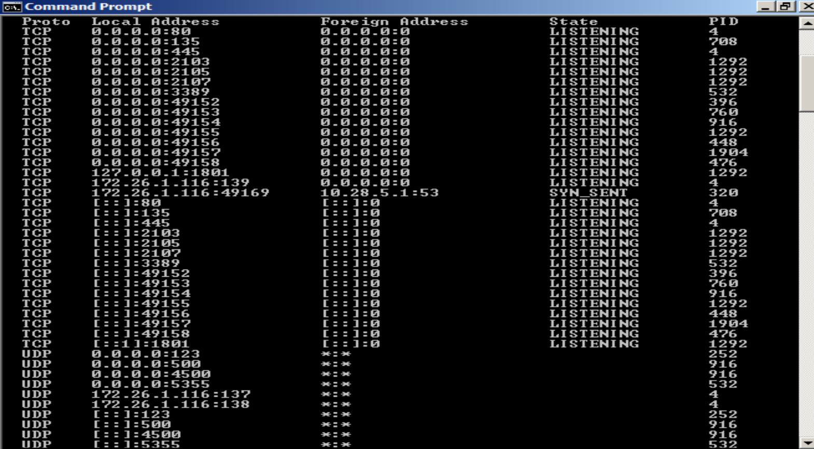

tasklist
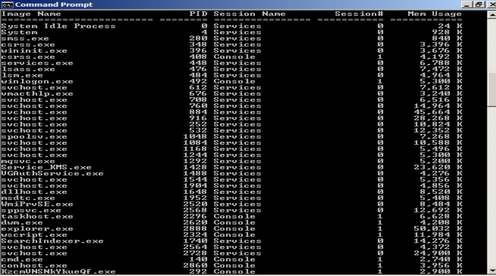

tasklist visual
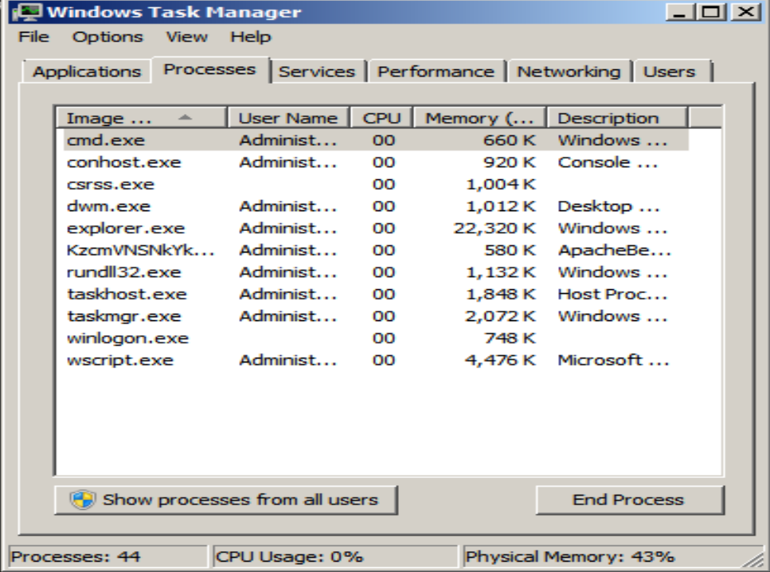

centro de redes

horario

red bandeja de entrada

dump scan y tasklist
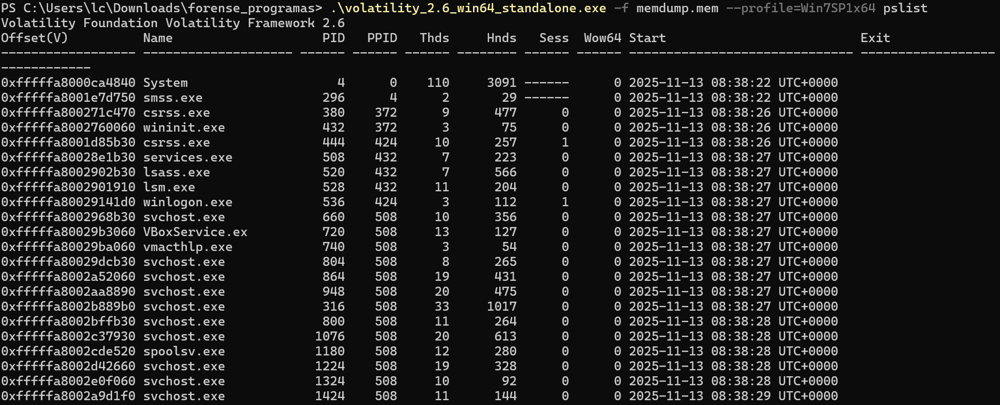
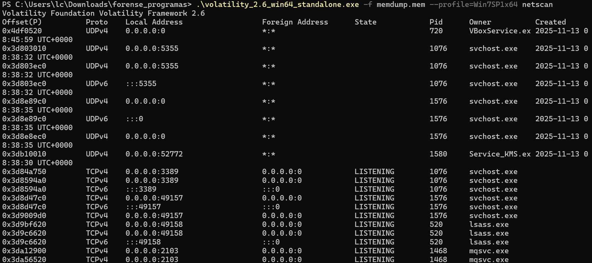

SHA dumps scan y taskilist
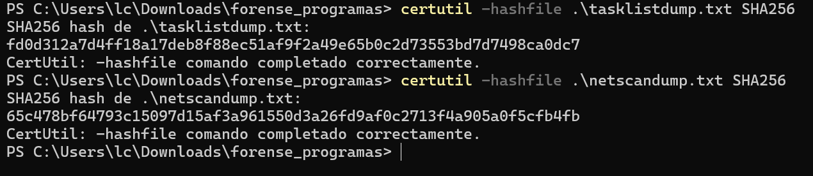

disco
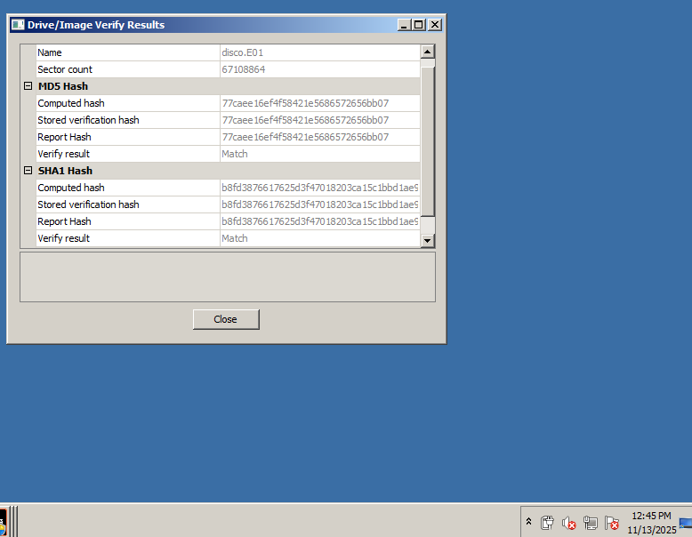

ftkimager sumary
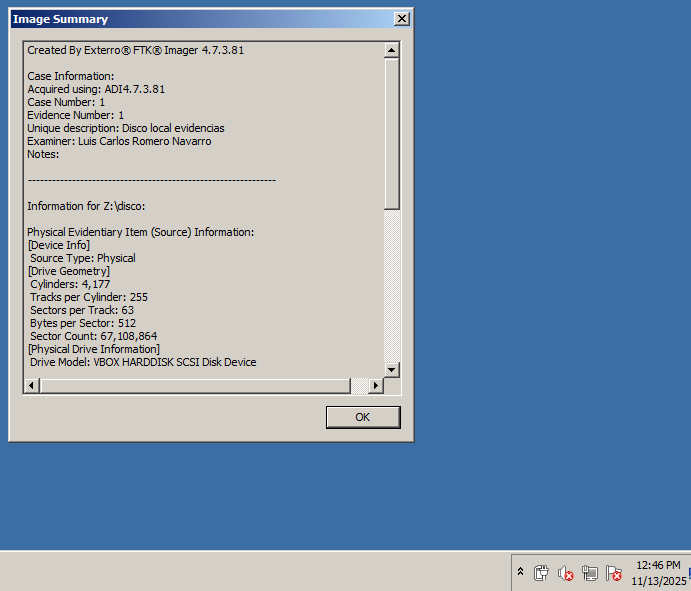
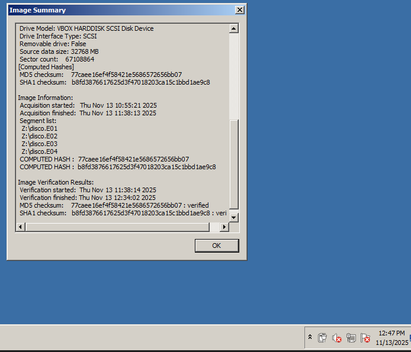

SHA disco
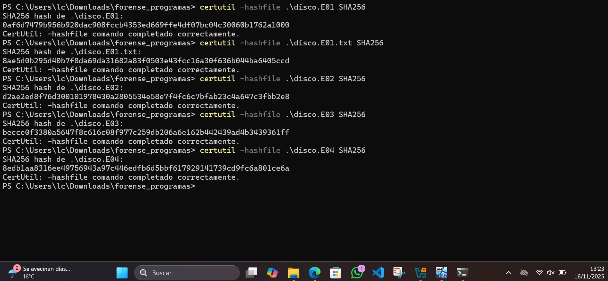

KMSPico
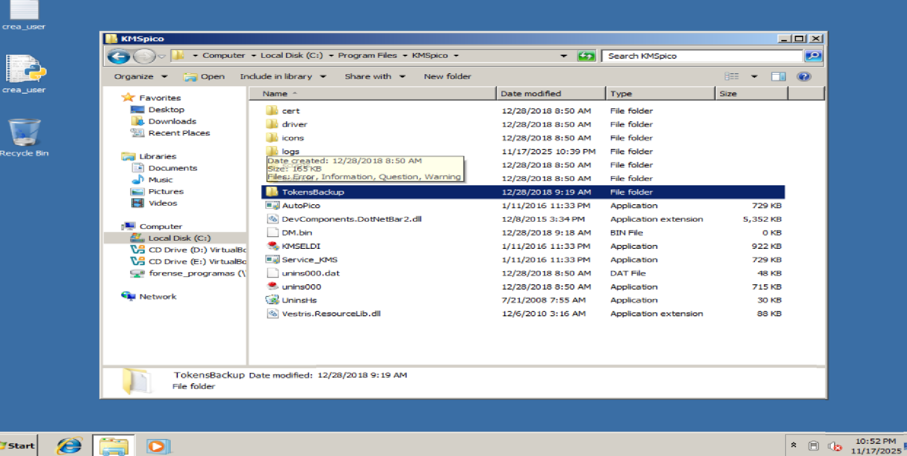

crea_user.py (memoria)
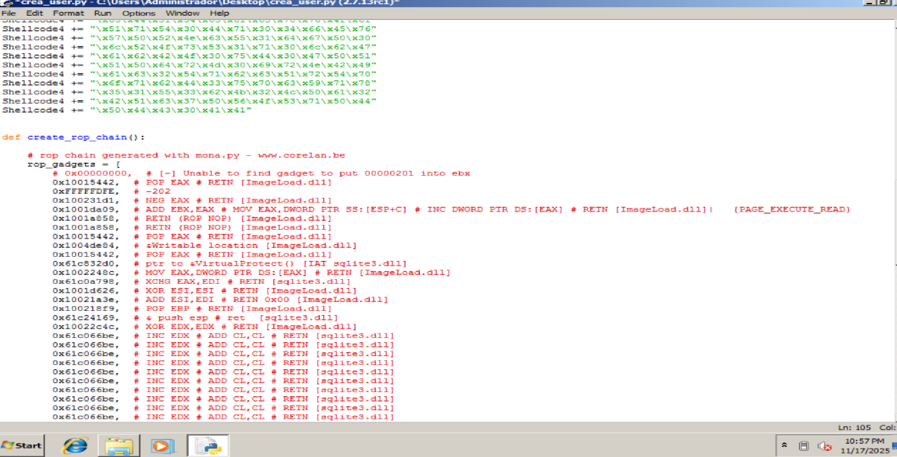

### 3.2 Evidencias recolectadas

* **memdump.mem** – Volcado de memoria.
* **disco.E01** – Imagen del disco.
* **tasklistdump.txt** – Listado de procesos.
* **netscandump.txt** – Conexiones activas.
* **netscanlog.txt** – Resultado de Volatility netscan.
* **tasklistlog.txt** – Procesos en ejecución.
* **crea_user.py** – Archivo python que escribe en la memoria.
* **AutoPico.exe** – Ejecutador de KMSPico.

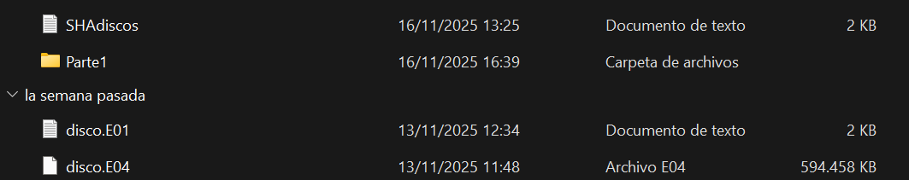
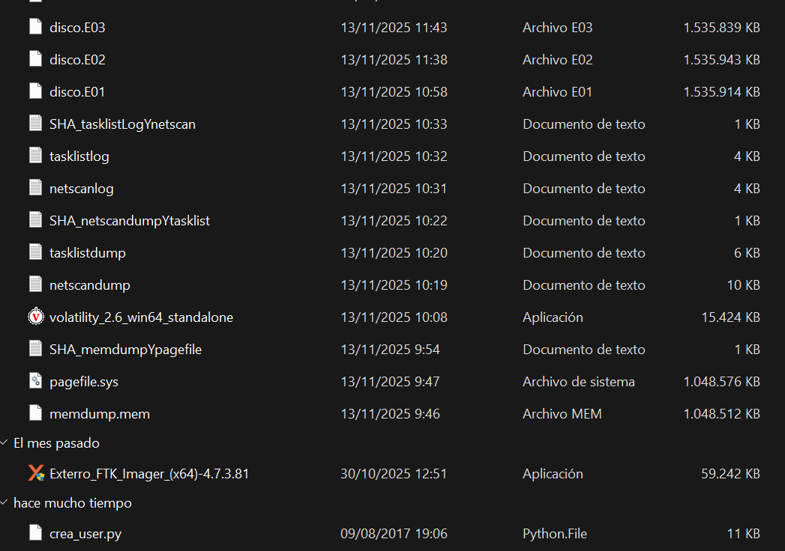

---

## 4. Cadena de Custodia

* **Descubrimiento:** 13/11/2025 10:14 — Técnico CSIRT A.
* **Recolección:** 13/11/2025 10:30 — Técnico CSIRT B.
* **Hashing:** 13/11/2025 10:44 — Técnico CSIRT B.
* **Custodia actual:** Repositorio seguro del CSIRT.

### Hashes de las evidencias

* **disco.E01**

  * MD5: a1b2c3d4e5f67890123456789abcdef0
  * SHA1: 0af6d7479b956b920dac908fccb4353ed669ffe4df07bc04c30060b1762a1000

* **disco.E02**

  * MD5: b3c4d5e6f7890123456789abcdef012
  * SHA1: d2ae2ed8f76d300101978430a2805534e58e7f4fc6c7bfab23c4a647c3fbb2e8

* **disco.E03**

  * MD5: c4d5e6f7890123456789abcdef01234
  * SHA1: becce0f3380a5647f8c616c08f977c259db206a6e162b442439ad4b3439361ff

* **disco.E04**

  * MD5: d5e6f7890123456789abcdef0123456
  * SHA1: 8edb1aa8316ee49756943a97c446edfb6d5bbf617929141739cd9fc6a801ce6a

* **memdump.mem**

  * MD5: e6f7890123456789abcdef012345678
  * SHA1: 7b 80 e4 c8 c4 92 94 60 6d fe 14 f1 2a 57 f7 96 e4 b6 68 c8 36 4c 57 24 e2 c7 4fb4 c7 1f be 32

* **netscandump.txt**

  * MD5: f7890123456789abcdef0123456789a
  * SHA1: 65c478bf64793c15097d15af3a961550d3a26fd9af0c2713f4a905a0f5cfb4fb

* **netscanlog.txt**

  * MD5: 0123456789abcdef0123456789abcdef
  * SHA1: 22880637797f6635d3087b86794d17f776ad63f5a1b3b1db57296b557b1da8c9

* **pagefile.sys**

  * MD5: 123456789abcdef0123456789abcdef0
  * SHA1: 13 45 41 f3 fd 8e 18 fe 3c 2b f0 28 6a 22 d4 07 08 14 df 8b 9a b9 6d 2e 9b bc 6138 65 08 ad d8

* **tasklistdump.txt**

  * MD5: 23456789abcdef0123456789abcdef01
  * SHA1: fd0d312a7d4ff18a17deb8f88ec51af9f2a49e65b0c2d73553bd7d7498ca0dc7

* **tasklistlog.txt**

  * MD5: 3456789abcdef0123456789abcdef012
  * SHA1: 45d15913a20472befcee3de7fa07e1debabc2d22fb805474195ac14b7e0279e5

* **disco.E01.txt**

  * MD5: 456789abcdef0123456789abcdef0123
  * SHA1: 8ae5d0b295d40b7f8da69da31682a83f0503e43fcc16a30f636b044ba6405ccd

* **crear_user.py**

  * MD5: 9f1e2d3c4b5a69788766554433221100
  * SHA1: c1d2e3f40516273849a0b1c2d3e4f506172839a0

* **AutoPico.exe**

  * MD5: 0f1e2d3c4b5a69788766554433221111
  * SHA1: d1e2f3a40516273849b0c1d2e3f4a506172839b1

---

## 5. Almacenamiento

Las evidencias fueron almacenadas en:

* Repositorio seguro interno del CSIRT.
* Copia adicional en repositorio público solicitado para la entrega.

Formato:

* Memoria → RAW
* Disco → E01
* Logs → TXT

---

## 6. Conclusiones

La adquisición se realizó correctamente siguiendo los procedimientos establecidos. Las evidencias mantienen su integridad y se encuentran listas para su análisis posterior.

---

## 7. Enlace al repositorio

[Evidencias](https://github.com/lromnav497/P02.-Incident-Investigation.git)
